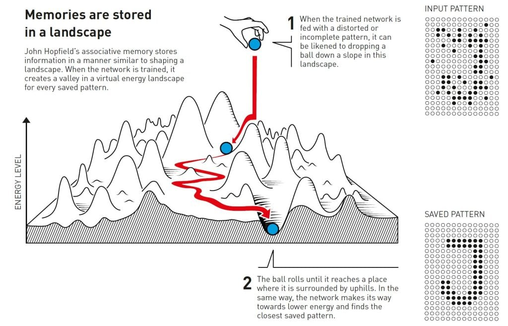

[{width="90%"}](hn.jpg)

2024 年的物理诺奖颁给了人工神经网络之父 Hinton，对物理专业的笔者而言，冲击无疑是巨大的。

AI 的风已经席卷到各行各业，物理学也不例外。
大一的时候，笔者曾对最近五年的 Physics Review 系列论文的标题和摘要进行了引用统计，位于关键词云图中央的赫然是 Machine Learning。
那时笔者不敢相信统计的数据，以为是把交叉学科的论文也统计进去了，遂手动删去了 Machine Learning 这个 stop word 。
直到诺奖结果公布，笔者才意识到，自己当时说不定已经看到了未来，至少是几年以内的未来。

笔者认为，自然科学和工程的发展无非是三个阶段的循环：Observation, Theory, Application.
物理学家，尤其是“传统”的物理学家，一般聚焦于观察和理论的阶段，致力于发现新的物理，无论是实验先验还是逻辑先验。
当然，我并没有排斥和贬低任何的工程科学，也没有反对物理学家使用工程师的思维来解决问题。
诚然，现代物理学体系日渐完善，前沿发展极端细分。
我所反对的，是物理学家困于工程师的思维尝试创造物理，但不能解释和分析之，也不能为社会带来实际的价值。
当物理学的工作变成调参，当领域细分的规律从普适逐渐变成了特殊，当物理学家需要用技术来理解研究对象时，物理学正在成为一种新的劳动密集型产业。
我不太清楚物理学的价值何在，我不太清楚物理研究的意义何在。

和手机，网络等技术一样，AI 正在逐渐成为我们身体和能力的延伸。当笔者执笔写下这段文字时，已经深深感到自己文笔的生疏，词汇的贫乏，以及思维的迟钝。
被日新月异技术裹携着，笔者对未来毫无头绪。唯望笔者能在 AI 洪流之下，仍然做一颗会思考的苇草。

这是理想乌托邦的落幕，也更是新世界的开端。

<!--Include social share buttons-->

<!--  -->
